# Level 4 实验记录：基于 U-Net / DiT 的手写笔记擦除

> 本文档是全部实验的正式记录：实验设置、同口径评测协议、主结果、消融、定性样例与结论。
> 任务定义、数据集分析与设计细节见 [README.md](README.md)；本文只回答"做了什么实验、结果如何、说明了什么"。
>
> 所有费用按 2 元/小时（RTX 4090 租用参考价）折算，**累计 ≈ 15.3 元（预算 30 元）**。

---

## 1. 实验总览

| # | 运行 | 日期 | 骨干 | 参数量 | 相对基线的差异 | 训练量 | 费用 | 结论 |
|---|---|---|---|---|---|---|---|---|
| 1 | **final20k** | 09-15 | U-Net base=48 | 17.7 M | 基线（mask_weight=5.0） | 20 000 步 / 62 min | 2.08 元 | 完整基线，满足验收 |
| 2 | unet96 | 09-16 | U-Net base=96 | 70.6 M | 容量 ×4 | 2 660 步（提前停） | 0.73 元 | +0.37 dB（噪声内），判定不值得 |
| 3 | sweep ×8 | 09-16 | U-Net base=48 | 17.7 M | ghost / HF / VGG 权重扫描 | 各 2 000 步 | ~1.0 元 | ghost 项有效；VGG 为负面结论 |
| 4 | **ghost20k** | 09-16 | U-Net base=48 | 17.7 M | + `w_ghost=2.0`（warmup 1000） | 20 000 步 / 68 min | 2.27 元 | 手写区误差 −62%，但过度擦除 |
| 5 | **dit20k** | 09-25/26 | DiT dim=384×8 | 14.6 M | 换骨干，同 `w_ghost=2.0` | 18 000 步（提前停） | 9.23 元 | 证实过度擦除与骨干无关；DiT 全面更差 |

统一训练配置（除注明外）：patch 256、batch 8、bf16 混合精度、AdamW + 余弦 LR、
数据 1712/214/214（按页面分组划分，seed 3407）、`--downscale 2`、文档增强 `DocAugment`、
手写偏置采样 60%、每 20 步在 12 张固定验证图上评估。

---

## 2. 评测协议

**数据**：test 划分前 40 张（`splits.json`，按页面分组划分防止同页泄漏）。
输入/GT 用 JPEG DCT 域缩放解码（`downscale=2`），预测 PNG 读回时不再缩放。

**指标**（全部与 GT 对比，定义见 `model.py: ink_metrics`）：

| 指标 | 定义 | 衡量什么 |
|---|---|---|
| PSNR / SSIM | 整图 | 端到端保真（含光度归一化贡献，约 71%） |
| **手写区误差** ink_err | 代理掩码内 mean&#124;pred−GT&#124; | 手写擦得干不干净（**核心指标**） |
| **非手写区误差** bg_err | 掩码外 mean&#124;pred−GT&#124; | 是否为擦手写而误伤印刷内容 |
| **灰印残留** ghost_keep | 掩码内输出侧局部暗度 / 输入侧 | 擦除后残留的"笔画状灰影" |
| **墨迹保留率** ink_keep | 输出墨迹像素占比 / GT 墨迹占比 | 印刷文字/表格线是否被误擦（1.0 理想） |
| 擦除率 removed_frac | 1 − mean&#124;out−GT&#124; / mean&#124;in−GT&#124; | 输入与 GT 的差异被消除的比例 |
| INK_LOST | ink_keep < 0.5 的张数 | 印刷内容明显丢失的失败案例 |

代理掩码用局部对比度判据（比邻域暗 > 0.12 且 GT 处白底），覆盖率约 1%，
掩码 < 50 px 的样本不计入误差分解（40 张中有 1 张）。

**口径校验**：第 3 节表格由同一脚本对全部 5 组产物一次性重算，
final20k / ghost20k 的结果与既往记录逐项吻合（0.165 / 0.042 / 57.1% / 20.65 / 0.828 / 2），
口径可信。

---

## 3. 主结果：U-Net vs DiT（同口径，40 张测试图）

| 模型 | ckpt 口径 | 手写区误差 ↓ | 非手写区误差 ↓ | 灰印残留 ↓ | PSNR (dB) ↑ | SSIM ↑ | 墨迹保留率 ↑ | 擦除率 ↑ | INK_LOST ↓ |
|---|---|---|---|---|---|---|---|---|---|
| 输入（不处理） | — | — | — | 100% | 10.21 | 0.7196 | 1.000 | 0 | 0/40 |
| **final20k**（UNet） | best | 0.165 | **0.042** | 57.1% | **20.65** | **0.8987** | **0.828** | **0.811** | **2/40** |
| **ghost20k**（UNet + w_ghost=2.0） | best（按 PSNR） | 0.063 | 0.054 | 20.2% | 19.37 | 0.8754 | 0.561 | 0.770 | 16/40 |
| | best_ink（按手写区误差） | **0.053** | 0.065 | **15.8%** | 18.24 | 0.8357 | 0.462 | 0.734 | 25/40 |
| **dit20k**（DiT，同 w_ghost=2.0） | best（按 PSNR） | 0.121 | 0.074 | 28.3% | 18.69 | 0.8662 | 0.745 | 0.707 | 8/40 |
| | best_ink（按手写区误差） | 0.105 | 0.081 | 21.3% | 17.91 | 0.8430 | 0.578 | 0.680 | 15/40 |

40 张中 PSNR 获得提升的：final20k **40/40**，ghost20k 39/40，dit20k 38~39/40。

### 主要发现

**F1 — 回归基线的天花板是"灰印子"，不是 PSNR。**
final20k 的 PSNR/SSIM/擦除率都不差，但手写区误差是非手写区的 4 倍（0.165 vs 0.042），
灰印残留 57%——肉眼里手写内容仍清晰可辨，只是变淡。这是 L1/SSIM 条件均值解的固有行为：
手写只占 2%~8% 像素，均值的"最安全解"是少擦一点。

**F2 — ghost 损失项方向正确、剂量过头。**
`w_ghost=2.0` 把手写区误差砍掉 62%（0.165→0.063）、灰印残留 57%→20%，
但"把细暗笔画推向 0"的行为通过卷积泛化到了掩码外的印刷细线：
非手写区误差 +30%、墨迹保留率 0.828→0.561、16/40 张 INK_LOST。
500~2000 步扫描时观察到的"非手写区误差随步数收敛"被 20k 全量训练**证伪**——它持续恶化。

**F3 — 过度擦除与骨干无关（本次实验的核心假设，已证实）。**
DiT 用同样的 `w_ghost=2.0` 同样误伤印刷内容：非手写区误差 0.074~0.081（基线 0.042，+77%~93%），
墨迹保留率 0.58~0.75。过度擦除是 ghost 项的固有属性，换骨干解决不了，
修正只能从损失函数入手（降权重 / 退火 / 改 ckpt 选择标准）。

**F4 — 256px 尺度上 DiT 全面劣于 U-Net，且贵 5 倍。**
同样的 w_ghost，DiT 擦除更差（0.105~0.121 vs 0.053~0.063）、误伤更多、PSNR 更低
（17.9~18.7 vs 18.2~19.4），而每步 808 ms 是 U-Net（158 ms）的 5 倍。
/4 分辨率下 4096 token 的全局自注意力是平方开销，卷积 U-Net 参数涨得快、算力涨得慢。
**DiT 直接回归路线关闭**；想用满显存换质量应加大 `--base_ch`（但见第 5 节，收益也在噪声内）。

### 训练曲线

| final20k（UNet 基线） | ghost20k（UNet + ghost） | dit20k（DiT + ghost） |
|---|---|---|
| 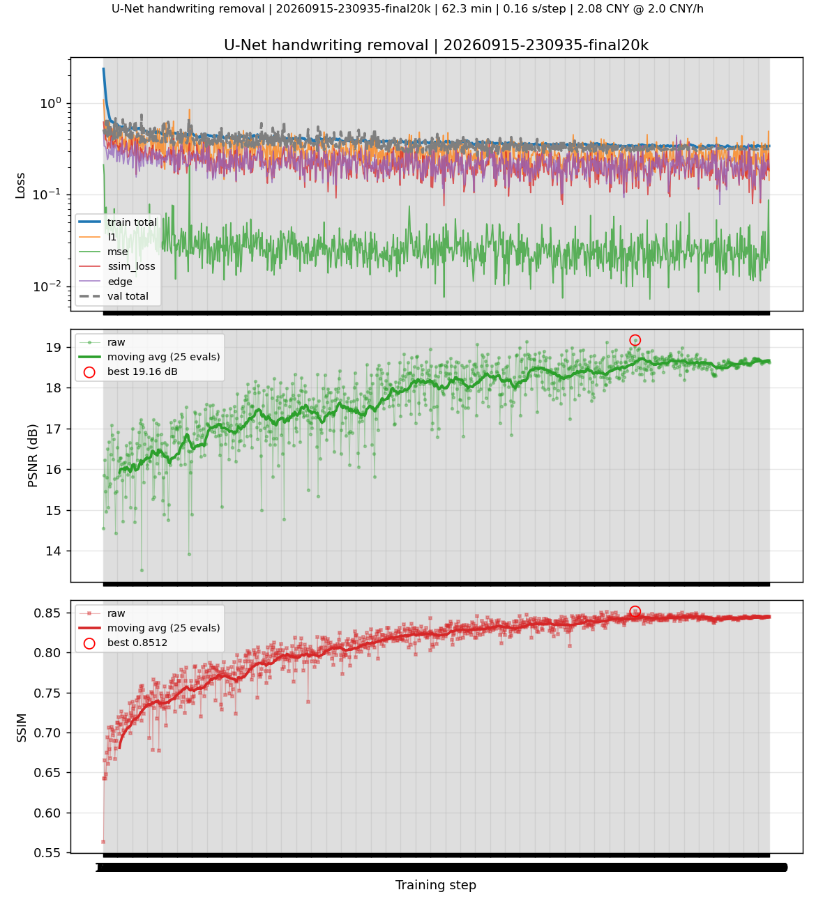 | 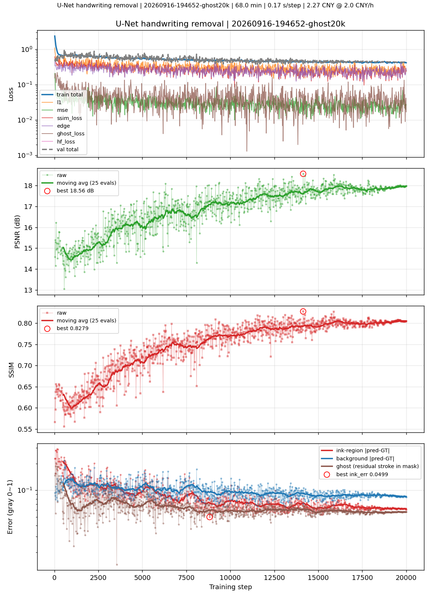 | 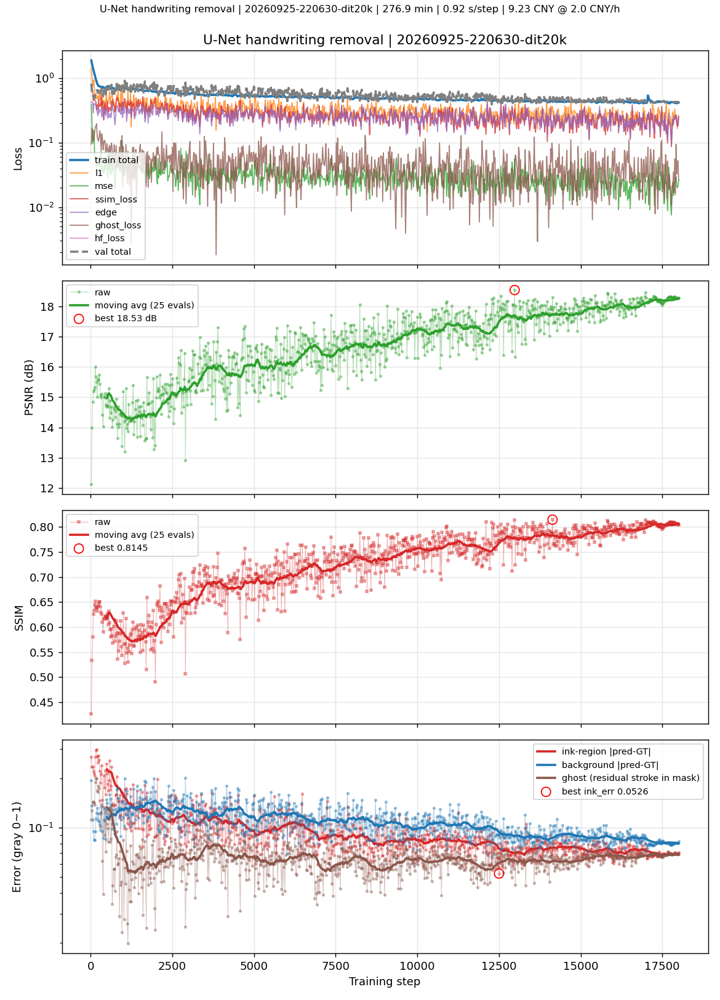 |

---

## 4. 消融：损失权重扫描（2 000 步 × 8 组，`limit_train 64`，取后 60% 步平均）

| 配置 | PSNR ↑ | SSIM ↑ | 手写区误差 ↓ | 非手写区误差 ↓ | 灰印 ↓ | 残留率 ↓ |
|---|---|---|---|---|---|---|
| base（无新损失项） | 16.27 | 0.7530 | 0.3229 | 0.0983 | 0.2160 | 94.4% |
| g10w：`w_ghost=1.0`，warmup 500 | 15.34 | 0.6901 | 0.1520 | 0.1109 | 0.0727 | 29.3% |
| **g20w：`w_ghost=2.0`，warmup 500** | 14.86 | 0.6558 | **0.1366** | 0.1175 | **0.0573** | **23.2%** |
| vgg：`w_vgg=0.5`（VGG16 浅层感知损失） | 16.71 | 0.7764 | 0.3461 | 0.0920 | 0.2448 | **110.0%** |
| g20wv：`w_ghost=2.0` + `w_vgg=0.25` | 15.21 | 0.6793 | 0.1395 | 0.1130 | 0.0645 | 27.5% |

三条结论：

1. **ghost 项在小尺度上即有效**：手写区误差 −53%~−58%，灰印 −66%~−74%。
2. **VGG 感知损失是负面结论，已从代码删除**：PSNR 虽 +0.43 dB，但灰印 +13%、
   残留率 110%（比不处理还差）。原因：VGG16 是 ImageNet 自然图像特征，
   对"白底 + 细黑字"的文档图，浅层响应的是纸张纹理/JPEG 伪影而非笔画结构；
   且每步耗时翻倍。这是"PSNR 涨了但任务没做好"的又一次复现。
3. 扫描中"非手写区误差随步数收敛"的乐观观察（500 步 +52% → 2000 步 +19.5%）
   被 20k 全量训练证伪（F2），**小规模扫描的外推必须谨慎**。

---

## 5. 骨干与容量对比

推理/训练开销实测（patch 256）：

| 配置 | 参数量 | 峰值显存 | 每步耗时 |
|---|---|---|---|
| U-Net base=48（基线，bs8） | 17.7 M | 3.04 GB | 158 ms |
| U-Net base=64（bs8） | 31.4 M | 4.18 GB | 214 ms |
| U-Net base=96（bs8） | 70.6 M | 6.67 GB | 402 ms |
| U-Net base=128（bs4） | 125.5 M | 5.86 GB | 322 ms |
| DiT dim=256, 6 blocks（bs8） | 6.1 M | 3.42 GB | 488 ms |
| DiT dim=384, 8 blocks（bs8） | 16.2 M | 5.49 GB | 808 ms |

**容量判定（unet96，实验 #2）**：相同 step 数逐窗口对比 base=96 vs base=48，
12 张验证图上 ΔPSNR 均值 **+0.37 dB**，窗口间波动 ±0.5 dB（在验证噪声内），
代价是 4 倍参数、2.5 倍算力。两个失效模式（灰印子、细线被冲淡）是**目标函数问题，
不是容量问题**——加大模型只是把条件均值拟合得更准。已停（step 2660/20000，0.73 元）。

**骨干判定（dit20k，实验 #5）**：见第 3 节 F3/F4。DiT 与 U-Net 同为"直接回归 + 残差学习"，
DiT 采用 patch 化 token + 全局自注意力 + 2D RoPE + CNN 高分辨率旁路（NAFNet/Restormer 式），
单步出结果、无扩散采样。结果全面更差且贵 5 倍，**路线关闭**。
从零训扩散模型在 30 元预算内不可行（数百 GPU·小时）；可行的扩散路线是
SD-Inpainting + LoRA 微调（分析见 README"改进方案"B 节），未在本轮实施。

---

## 6. 定性结果

每组三联图为 输入（拍摄+手写）｜预测｜GT（干净版）。三个样例分别代表典型情况、最难样本、过度擦除对照。

### 样例 1：典型（测试集 PSNR 中位数附近）

| final20k（UNet） | ghost20k（UNet + ghost） | dit20k（DiT） |
|:---:|:---:|:---:|
| 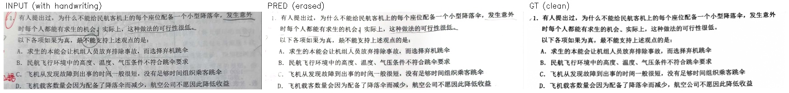 | 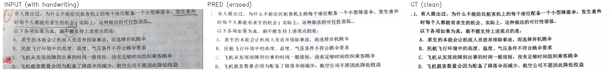 | 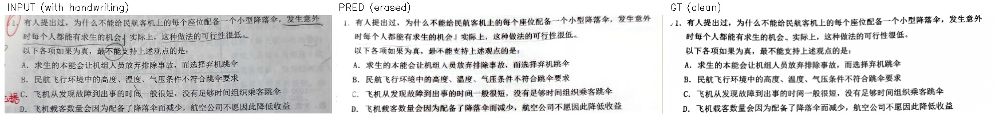 |

PSNR 12.6→19.9 / 19.4 / 20.8 dB，墨迹保留率 0.77 / 0.57 / 0.87。
final20k 手写处可见淡灰印子；两个 ghost 系模型印子更淡，但印刷细线同时变浅。

### 样例 2：最难样本（测试集 PSNR 最低）

| final20k（UNet） | ghost20k（UNet + ghost） | dit20k（DiT） |
|:---:|:---:|:---:|
| 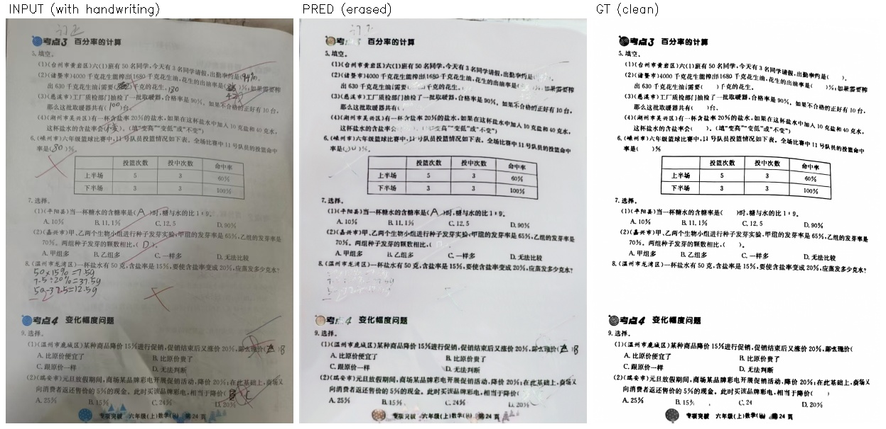 | 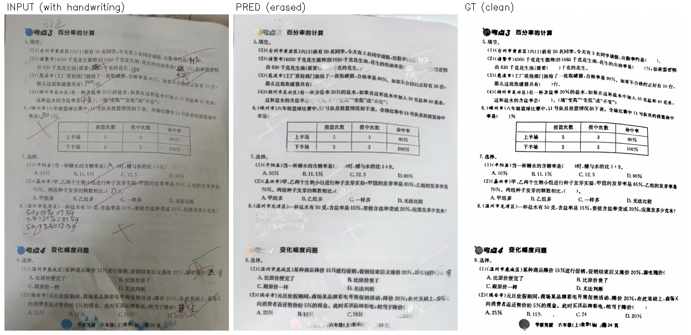 | 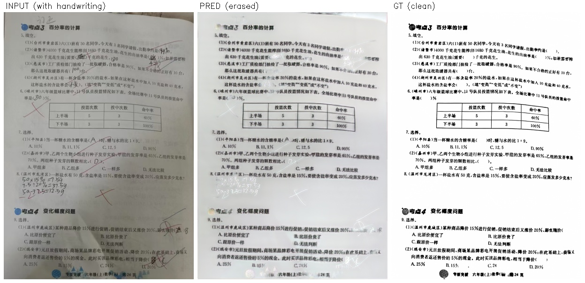 |

PSNR 仅 7.9→15.5 / 15.3 / 14.9 dB，墨迹保留率 > 1（输出墨迹比 GT 还多）。
此类样本是当前结构的共同失效场景：**深色手写压在印刷体上**——代理掩码判据
`GT 处白底` 会排除被印刷内容覆盖的手写区，只能靠基础 L1 覆盖，输出为折中的灰色。

### 样例 3：过度擦除对照（ghost 系模型的代价）

| final20k（UNet） | ghost20k（UNet + ghost） | dit20k（DiT） |
|:---:|:---:|:---:|
| 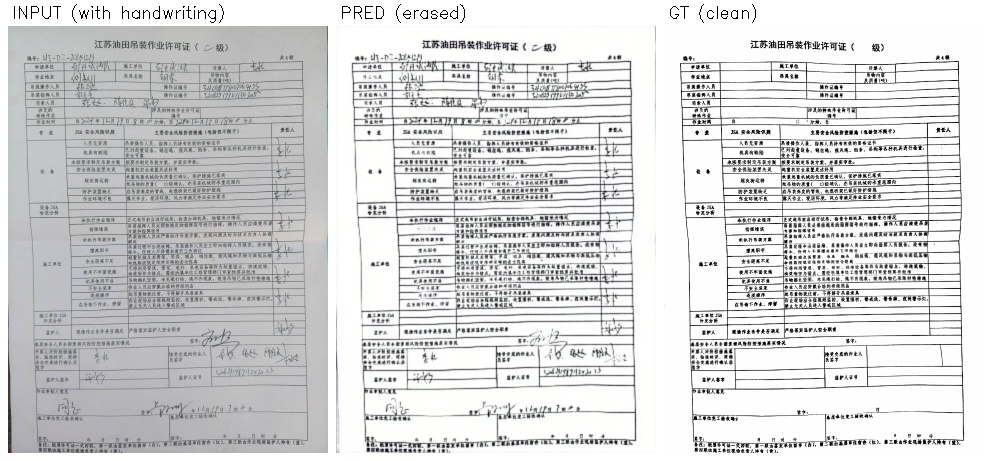 | 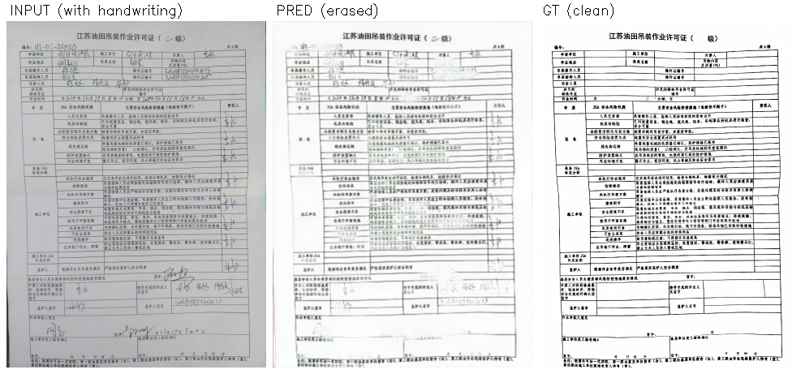 | 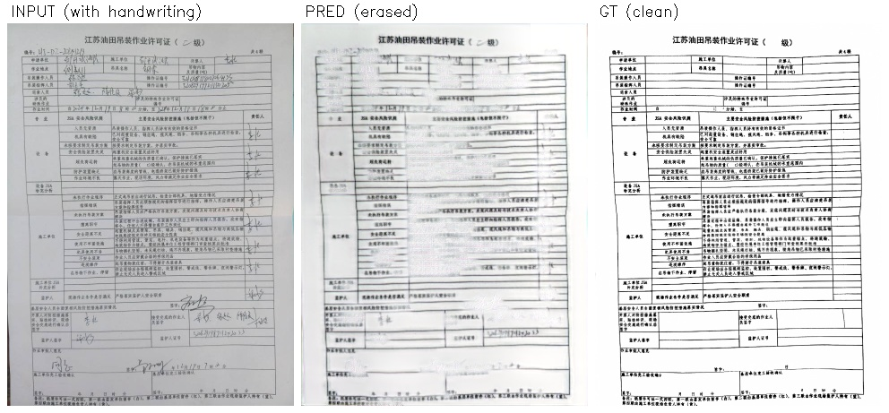 |

final20k 墨迹保留率 0.93（安全但灰印重）；ghost20k 与 dit20k 分别掉到 0.25 / 0.42，
均触发 `INK_LOST`（印刷内容明显丢失），PSNR 同步下滑 19.7→17.2 / 15.4 dB。
"往激进方向推"的损失必须配一个保守口径的 ckpt（best.pth 按 PSNR 自动充当该角色）。

---

## 7. 失效模式汇总

| # | 现象 | 根因 | 状态 |
|---|---|---|---|
| 1 | 擦除后留淡灰印子，手写仍可辨 | L1/SSIM 条件均值解；手写像素占比低 | ghost 项基本解决（残留 57%→16~20%），但引入 #3 |
| 2 | 浅色印刷细线（插画/装饰）被冲淡 | 光度归一化学得过于激进 | 未解决，对应 final20k 2/40 INK_LOST |
| 3 | 印刷细线被误擦（ghost 剂量过大） | "推暗笔画向 0"泛化到掩码外 | 待修：w_ghost 0.5~1.0 / 后期退火 / 组合分选 ckpt |
| 4 | 深色手写压在印刷体上擦不净 | 代理掩码排除"GT 非白底"区域 | 结构性限制，需双分支或笔画检测器 |
| 5 | 轻微结构异常/插画类样本劣化 | GT 为自动流程生成，存在语义异常 | 数据侧问题，属指标上限 |

---

## 8. 结论与后续工作

**当前最优可用模型**：`ghost20k best.pth`（UNet base=48 + w_ghost=2.0，step 14140）——
手写区误差 0.063（比基线 −62%）、灰印残留 20%；代价是墨迹保留率 0.561。
若以印刷保真优先（如归档场景），用 `final20k best.pth`（墨迹保留 0.828，但灰印 57%）。
两者均已满足"无全白/无全黑"的验收要求。

**后续实验按性价比排序**（只在 U-Net 上做）：

1. `w_ghost` 降到 **0.5~1.0** 重跑 20k（预计 ~2.3 元）——最直接的剂量修正
2. ghost 权重**后期退火**（warmup 到峰值后 cosine 衰减）：前 20% 步"先归一后擦除"，
   后 80% 步让 L1 收回印刷保真
3. best ckpt 选择标准改为 `ink_err + 2·bg_err` 组合分，显式平衡擦除与保真
4. 更远的方向：轻量笔画检测器 + 双分支（mask 外强制保留原图）、SD-Inpainting LoRA 微调、
   OCR 准确率（CER）作为比 PSNR 更可信的下游指标

---

## 9. 复现

```bash
pip install -r requirements.txt

# 数据清洗与划分（已执行：2412 对 -> 2140 对）
python data.py --root data/deli --out splits.json --downscale 2

# 快速验证流程（~0.5 min）
python train.py --splits splits.json --limit_train 64 --max_steps 100 --eval_every 20 --patch 192 --tag quick

# 基线 final20k（UNet）
python train.py --splits splits.json --max_steps 20000 --eval_every 20 --batch_size 8 \
    --patch 256 --base_ch 48 --mask_weight 5.0 --amp bf16 --tag final20k

# ghost20k（UNet + 灰印子损失）
python train.py --splits splits.json --max_steps 20000 --eval_every 20 --batch_size 8 \
    --patch 256 --base_ch 48 --mask_weight 5.0 --w_ghost 2.0 --ghost_warmup 1000 --amp bf16 --tag ghost20k

# dit20k（DiT 骨干对照）
python train.py --splits splits.json --max_steps 20000 --eval_every 20 --batch_size 8 \
    --patch 256 --arch dit --base_ch 32 --dim 384 --blocks 8 --lr 1e-4 --mask_weight 5.0 \
    --w_ghost 2.0 --ghost_warmup 1000 --amp bf16 --tag dit20k

# 测试集推理 + 指标 + 三联对比图（40 张，~0.5 min）
python inference.py --ckpt runs/<run>/best.pth --splits splits.json --split test \
    --output pred_<tag> --limit 40 --tile 256
```

硬件：RTX 5060 Laptop（8.5 GB），PyTorch 2.11.0+cu128，Python 3.13.9（详见 `requirements.txt`）。

---

## 10. 附录：本目录产物清单（`results/`）

| 文件 | 来源 |
|---|---|
| `report_final20k.json` | `pred/`（final20k best，40 张逐张指标） |
| `report_ghost20k_best.json` / `_bestink.json` | `pred_ghost_bestpsnr/` / `pred_ghost/` |
| `report_dit20k_best.json` / `_bestink.json` | `pred_dit_bestpsnr/` / `pred_dit/` |
| `curves_final20k.png` + `log_final20k.csv` | `runs/20260915-230935-final20k/` |
| `curves_ghost20k.png` + `log_ghost20k.csv` | `runs/20260916-194652-ghost20k/` |
| `curves_dit20k.png` + `log_dit20k.csv` | `runs/20260925-220630-dit20k/` |
| `compare/<model>__<样例>__<图名>.jpg` | 三组定性样例的三联对比图 |

完整的 40 张对比图与模型权重在本地 `pred*/`、`runs/*/`（体积原因不入库）。
